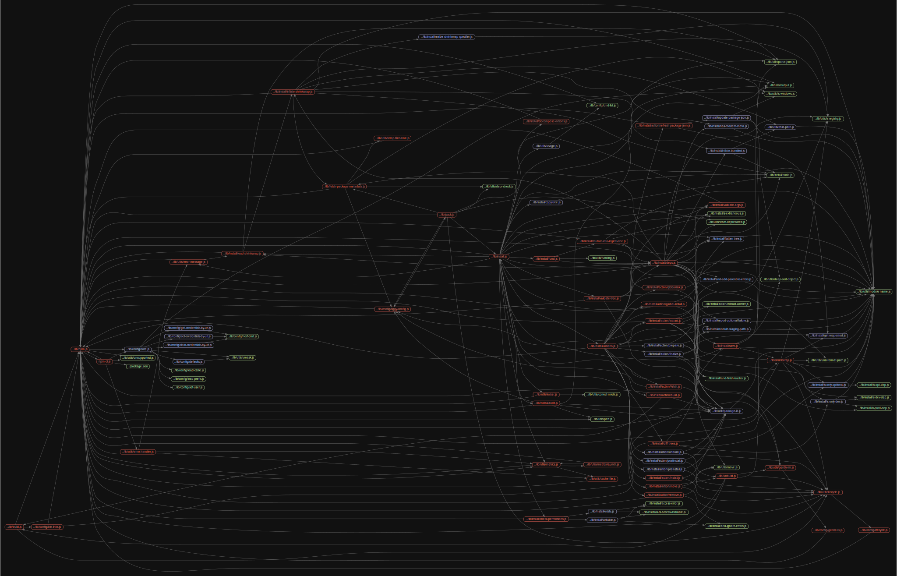

# 源码分析

## 文件结构

``` bash
/Users/liufang/openSource/FunnyLiu/cli
├── bin
|  ├── node-gyp-bin
|  |  ├── node-gyp
|  |  └── node-gyp.cmd
|  ├── npm
|  ├── npm-cli.js - npm命令的入口文件
|  ├── npm.cmd
|  ├── npx
|  ├── npx-cli.js
|  └── npx.cmd
├── configure
├── lib - lib一级目录下为各个子命令具体实现
|  ├── access.js
|  ├── adduser.js
|  ├── audit.js
|  ├── auth
|  |  ├── legacy.js
|  |  ├── oauth.js
|  |  ├── saml.js
|  |  └── sso.js
|  ├── bin.js
|  ├── bugs.js
|  ├── build.js
|  ├── cache.js
|  ├── ci.js
|  ├── completion.js
|  ├── config
|  |  ├── bin-links.js
|  |  ├── clear-credentials-by-uri.js
|  |  ├── cmd-list.js
|  |  ├── core.js
|  |  ├── defaults.js
|  |  ├── figgy-config.js
|  |  ├── gentle-fs.js
|  |  ├── get-credentials-by-uri.js
|  |  ├── lifecycle.js
|  |  ├── load-cafile.js
|  |  ├── load-prefix.js
|  |  ├── nerf-dart.js
|  |  ├── set-credentials-by-uri.js
|  |  └── set-user.js
|  ├── config.js
|  ├── dedupe.js
|  ├── deprecate.js
|  ├── dist-tag.js
|  ├── docs.js
|  ├── doctor
|  |  ├── check-files-permission.js
|  |  ├── check-ping.js
|  |  ├── get-git-path.js
|  |  ├── get-latest-nodejs-version.js
|  |  ├── get-latest-npm-version.js
|  |  └── verify-cached-files.js
|  ├── doctor.js
|  ├── edit.js
|  ├── explore.js
|  ├── fetch-package-metadata.js
|  ├── fetch-package-metadata.md
|  ├── fund.js
|  ├── get.js
|  ├── help-search.js
|  ├── help.js
|  ├── hook.js
|  ├── init.js
|  ├── install
|  |  ├── access-error.js
|  |  ├── action
|  |  |  ├── build.js
|  |  |  ├── extract-worker.js
|  |  |  ├── extract.js
|  |  |  ├── fetch.js
|  |  |  ├── finalize.js
|  |  |  ├── global-install.js
|  |  |  ├── global-link.js
|  |  |  ├── install.js
|  |  |  ├── move.js
|  |  |  ├── postinstall.js
|  |  |  ├── preinstall.js
|  |  |  ├── prepare.js
|  |  |  ├── refresh-package-json.js
|  |  |  ├── remove.js
|  |  |  └── unbuild.js
|  |  ├── actions.js
|  |  ├── and-add-parent-to-errors.js
|  |  ├── and-finish-tracker.js
|  |  ├── and-ignore-errors.js
|  |  ├── audit.js
|  |  ├── check-permissions.js
|  |  ├── copy-tree.js
|  |  ├── decompose-actions.js
|  |  ├── deps.js
|  |  ├── diff-trees.js
|  |  ├── exists.js
|  |  ├── flatten-tree.js
|  |  ├── fund.js
|  |  ├── get-requested.js
|  |  ├── has-modern-meta.js
|  |  ├── inflate-bundled.js
|  |  ├── inflate-shrinkwrap.js
|  |  ├── is-dev-dep.js
|  |  ├── is-extraneous.js
|  |  ├── is-fs-access-available.js
|  |  ├── is-only-dev.js
|  |  ├── is-only-optional.js
|  |  ├── is-opt-dep.js
|  |  ├── is-prod-dep.js
|  |  ├── module-staging-path.js
|  |  ├── mutate-into-logical-tree.js
|  |  ├── node.js
|  |  ├── read-shrinkwrap.js
|  |  ├── realize-shrinkwrap-specifier.js
|  |  ├── report-optional-failure.js
|  |  ├── save.js
|  |  ├── update-package-json.js
|  |  ├── validate-args.js
|  |  ├── validate-tree.js
|  |  └── writable.js
|  ├── install-ci-test.js
|  ├── install-test.js
|  ├── install.js
|  ├── link.js
|  ├── logout.js
|  ├── ls.js
|  ├── npm.js
|  ├── org.js
|  ├── outdated.js
|  ├── owner.js
|  ├── pack.js
|  ├── ping.js
|  ├── prefix.js
|  ├── profile.js
|  ├── prune.js
|  ├── publish.js
|  ├── rebuild.js
|  ├── repo.js - npm repo 具体执行实现
|  ├── restart.js
|  ├── root.js
|  ├── run-script.js - npm run *** 的实现，npm run 的时候执行子shell命令的实现，基于npm-lifecycle->child_process模块开启子进程来完成
|  ├── search
|  |  ├── all-package-metadata.js
|  |  ├── all-package-search.js
|  |  ├── format-package-stream.js
|  |  └── package-filter.js
|  ├── search.js
|  ├── set.js
|  ├── shrinkwrap.js
|  ├── star.js
|  ├── stars.js
|  ├── start.js
|  ├── stop.js
|  ├── substack.js
|  ├── team.js
|  ├── test.js
|  ├── token.js
|  ├── unbuild.js
|  ├── uninstall.js
|  ├── unpublish.js
|  ├── update.js
|  ├── utils
|  |  ├── ansi-trim.js
|  |  ├── cache-file.js
|  |  ├── child-path.js
|  |  ├── completion
|  |  |  ├── file-completion.js
|  |  |  ├── installed-deep.js
|  |  |  └── installed-shallow.js
|  |  ├── completion.sh
|  |  ├── correct-mkdir.js
|  |  ├── deep-sort-object.js
|  |  ├── depr-check.js
|  |  ├── did-you-mean.js
|  |  ├── error-handler.js
|  |  ├── error-message.js
|  |  ├── escape-arg.js
|  |  ├── escape-exec-path.js
|  |  ├── funding.js
|  |  ├── gently-rm.js
|  |  ├── git.js
|  |  ├── gunzip-maybe.js
|  |  ├── is-registry.js
|  |  ├── is-windows-bash.js
|  |  ├── is-windows-shell.js
|  |  ├── is-windows.js
|  |  ├── lifecycle-cmd.js
|  |  ├── lifecycle.js
|  |  ├── link.js
|  |  ├── locker.js
|  |  ├── metrics-launch.js
|  |  ├── metrics.js
|  |  ├── module-name.js
|  |  ├── move.js
|  |  ├── no-progress-while-running.js
|  |  ├── open-url.js
|  |  ├── otplease.js
|  |  ├── output.js
|  |  ├── package-id.js
|  |  ├── parse-json.js
|  |  ├── perf.js
|  |  ├── pick-manifest-from-registry-metadata.js
|  |  ├── pulse-till-done.js
|  |  ├── read-local-package.js
|  |  ├── read-user-info.js
|  |  ├── save-stack.js
|  |  ├── spawn.js
|  |  ├── temp-filename.js
|  |  ├── umask.js
|  |  ├── unix-format-path.js
|  |  ├── unsupported.js - 判断兼容性范围
|  |  ├── usage.js
|  |  └── warn-deprecated.js
|  ├── version.js
|  ├── view.js
|  ├── visnup.js
|  ├── whoami.js
|  └── xmas.js
├── make.bat
├── package-lock.json
├── package.json
├── scripts
|  ├── changelog.js
|  ├── clean-old.sh
|  ├── dep-update
|  ├── dev-dep-update
|  ├── docs-build.js
|  ├── gen-changelog
|  ├── gen-dev-ignores.js
|  ├── install.sh
|  ├── maketest
|  ├── pr
|  ├── publish-tag.js
|  ├── release.sh
|  ├── relocate.sh
|  └── update-authors.sh

```

## 外部模块依赖

请在： http://npm.broofa.com?q=npm 查看

核心外部模块

- [npmlog](https://github.com/npm/npmlog) - npm命令可以使用的log封装

- [npm-lifecycle源码分析](https://github.com/FunnyLiu/npm-lifecycle/tree/readsource) - npm run 的时候执行子shell命令的实现，基于child_process模块开启子进程来完成


## 内部模块依赖


  
## 相关知识点

### bin/npm-cli.js

npm命令的入口文件。

### npm run ** 原理

npm run 的时候执行子shell命令的实现，基npm-lifecycle->child_process模块开启子进程来完成。我们每次在运行 scripts 中的一个属性时候(npm run),**实际系统都会自动新建一个shell(一般是Bash)，在这个shell里面执行指定的脚本命令。


npm(1) -- a JavaScript package manager
==============================

[](https://travis-ci.org/npm/cli)

## SYNOPSIS

This is just enough info to get you up and running.

Much more info will be available via `npm help` once it's installed.

## IMPORTANT

**You need node v6 or higher to run this program.**

To install an old **and unsupported** version of npm that works on node v5
and prior, clone the git repo and dig through the old tags and branches.

**npm is configured to use npm, Inc.'s public registry at
<https://registry.npmjs.org> by default.** Use of the npm public registry
is subject to terms of use available at <https://www.npmjs.com/policies/terms>.

You can configure npm to use any compatible registry you
like, and even run your own registry. Check out the [doc on
registries](https://docs.npmjs.com/misc/registry).

## Super Easy Install

npm is bundled with [node](https://nodejs.org/en/download/).

### Windows Computers

[Get the MSI](https://nodejs.org/en/download/).  npm is in it.

### Apple Macintosh Computers

[Get the pkg](https://nodejs.org/en/download/).  npm is in it.

### Other Sorts of Unices

Run `make install`.  npm will be installed with node.

If you want a more fancy pants install (a different version, customized
paths, etc.) then read on.

## Fancy Install (Unix)

There's a pretty robust install script at
<https://www.npmjs.com/install.sh>.  You can download that and run it.

Here's an example using curl:

```sh
curl -L https://www.npmjs.com/install.sh | sh
```

### Slightly Fancier

You can set any npm configuration params with that script:

```sh
npm_config_prefix=/some/path sh install.sh
```

Or, you can run it in uber-debuggery mode:

```sh
npm_debug=1 sh install.sh
```

### Even Fancier

Get the code with git.  Use `make` to build the docs and do other stuff.
If you plan on hacking on npm, `make link` is your friend.

If you've got the npm source code, you can also semi-permanently set
arbitrary config keys using the `./configure --key=val ...`, and then
run npm commands by doing `node bin/npm-cli.js <command> <args>`.  (This is helpful
for testing, or running stuff without actually installing npm itself.)

## Windows Install or Upgrade

Many improvements for Windows users have been made in npm 3 - you will have a better
experience if you run a recent version of npm. To upgrade, either use [Microsoft's
upgrade tool](https://github.com/felixrieseberg/npm-windows-upgrade),
[download a new version of Node](https://nodejs.org/en/download/),
or follow the Windows upgrade instructions in the
[Installing/upgrading npm](https://npm.community/t/installing-upgrading-npm/251/2) post.

If that's not fancy enough for you, then you can fetch the code with
git, and mess with it directly.

## Installing on Cygwin

No.

## Uninstalling

So sad to see you go.

```sh
sudo npm uninstall npm -g
```
Or, if that fails,

```sh
sudo make uninstall
```

## More Severe Uninstalling

Usually, the above instructions are sufficient.  That will remove
npm, but leave behind anything you've installed.

If you would like to remove all the packages that you have installed,
then you can use the `npm ls` command to find them, and then `npm rm` to
remove them.

To remove cruft left behind by npm 0.x, you can use the included
`clean-old.sh` script file.  You can run it conveniently like this:

```sh
npm explore npm -g -- sh scripts/clean-old.sh
```

npm uses two configuration files, one for per-user configs, and another
for global (every-user) configs.  You can view them by doing:

```sh
npm config get userconfig   # defaults to ~/.npmrc
npm config get globalconfig # defaults to /usr/local/etc/npmrc
```

Uninstalling npm does not remove configuration files by default.  You
must remove them yourself manually if you want them gone.  Note that
this means that future npm installs will not remember the settings that
you have chosen.

## More Docs

Check out the [docs](https://docs.npmjs.com/).

You can use the `npm help` command to read any of them.

If you're a developer, and you want to use npm to publish your program,
you should [read this](https://docs.npmjs.com/misc/developers).

## BUGS

When you find issues, please report them:

* web:
  <https://npm.community/c/bugs>

Be sure to include *all* of the output from the npm command that didn't work
as expected.  The `npm-debug.log` file is also helpful to provide.

You can also find npm people in `#npm` on https://package.community/ or
[on Twitter](https://twitter.com/npm_support).  Whoever responds will no
doubt tell you to put the output in a gist or email.

## SEE ALSO

* npm(1)
* npm-help(1)
